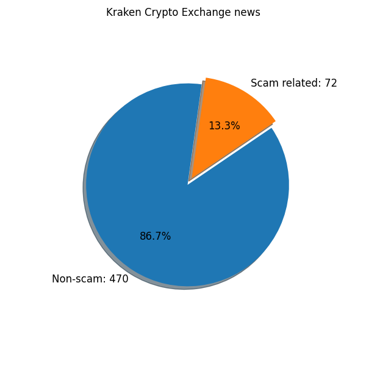

# Google_search
## Kraken

#### Entity type: Cryptocurrency Exchange

#### Associated scams

###### 2023-09-21

_Kraken User Lose $4.5M USDT In a Phishing Scam.
The user transferred the amount from his Kraken account to a fake Coinone crypto mining exchange
with the address ending in “ACa7”._

###### 2023-05-11

* _Someone pretending to be the US President tried to cheat a streamer out of half a million_
* _The fraudster used a Kraken-hosted bitcoin wallet address, which allowed the exchange to identify him_

_US-based crypto exchange Kraken created a fake crypto account to identify suspicious wallets and lure in
cybercriminals. In a contact center, an imposter pretending to be US President Joe Biden tried to cheat a streamer
out of almost half a million in bitcoin,
*crypto.news* [reported](https://crypto.news/kraken-creates-dummy-crypto-account-to-bait-con-artists/)._

_The streamer, Kitboga, features shows focused on provoking con artists. He tweeted yesterday that Kraken had created
a “tailored environment” for him to use in his most recent encounter with a cybercriminal, namely the one
pretending to be the president. The two have crossed paths previously. Before the last encounter,
they were in contact around a year ago._

## Graphs

#### The chart below illustrates scam-associated against total mentions of Kraken for weekly periods within Apr-Jul'23.

#### The following chart illustrates shares of non-scam and scam-related mentions in the whole 'pie' of articles.

#### Finally, the word-cloud below shows the most appearing words along with Kraken crypto exchange.

